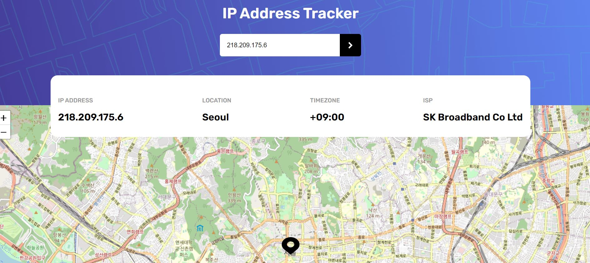

# Frontend Mentor - IP address tracker solution

This is a solution to the [IP address tracker challenge on Frontend Mentor](https://www.frontendmentor.io/challenges/ip-address-tracker-I8-0yYAH0). Frontend Mentor challenges help you improve your coding skills by building realistic projects.

## Table of contents

- [Overview](#overview)
  - [The challenge](#the-challenge)
  - [Screenshot](#screenshot)
  - [Links](#links)
- [My process](#my-process)
  - [Built with](#built-with)
  - [What I learned](#what-i-learned)
  - [Continued development](#continued-development)
- [Author](#author)
- [Acknowledgments](#acknowledgments)

## Overview

### The challenge

Users should be able to:

- View the optimal layout for each page depending on their device's screen size
- See hover states for all interactive elements on the page
- See their own IP address on the map on the initial page load
- Search for any IP addresses or domains and see the key information and location

### Screenshot

### Links

- Solution URL:https://github.com/jcasare/ip-address-tracker-master
- Live Site URL:https://jays-ip-tracker-app.onrender.com/

## My process

### Built with

- Semantic HTML5 markup
- CSS custom properties
- Flexbox
- CSS Grid
- [NodeJS](https://nodejs.org/) - JS Runtime Environment
- [ExpressJS](https://expressjs.com/) - NodeJS framework
- ES6

### What I learned

During this project, I learned how to use LeafletJS

### Continued development

I'd like to sharpen my Backend knowledge my taking on the E-commerce challenge

## Author

- Frontend Mentor - [@jcasare](https://www.frontendmentor.io/profile/jcasare)
- Twitter - [@vhybesofficial](https://www.twitter.com/vhybesofficial)
- GitHub - [@jcasare](https://github.com/jcasare)

## Acknowledgments

I'd like to firstly thank the Almighty God for the wisdom to be able to study full-stack web development and also thank Frontend Mentor for these challenges.
